# AWS-COGNITO

<details open="open">
<summary>目次</summary>


- [今回のシステム概要図](#今回のシステム概要図)
- [cognitoの設定](#cognitoの設定)
- [作業手順](#作業手順)
- [備考](#備考)
- [参考](#参考)
</details>

# 今回のシステム概要図
<details>
<summary> システム概要図</summary>

下記をcloudformation-baseで立ち上げ
- vpc
- サブネット
- igw
- ngw
- githubActions用のAssumeロール

下記をcloudformation-template.ymlで立ち上げる
- ALB
- ALBのリスナー
- Route53でAレコード追加してALBにルーティング
- ターゲットグループ（taskで立ち上がるコンテナへルーティング）
- ECSクラスター
- ECSサービス
- ECS task (ECRのイメージを使用)
- IAMロール（ECSのtask定義で使用）
- ECRのリポジトリ
- ALB/ECS/RDSのセキュリティーグループ
- SecretsManager

</details>


# cognitoの設定

<details>
<summary> 1. 特に別のIdPと連携しないなら、チェックなしで次に</summary>

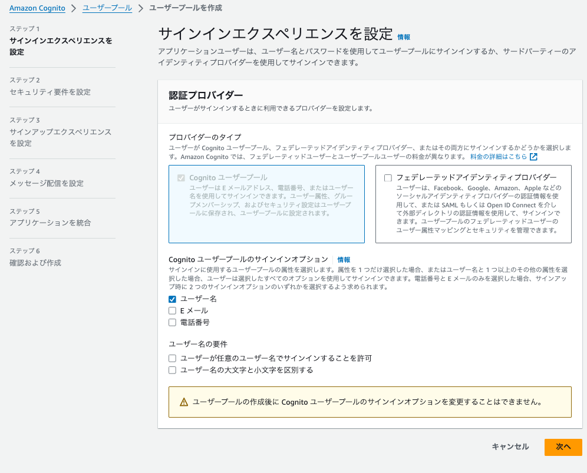

</details>

<details>
<summary> 2. MFA認証は入れる方がおすすめ</summary>

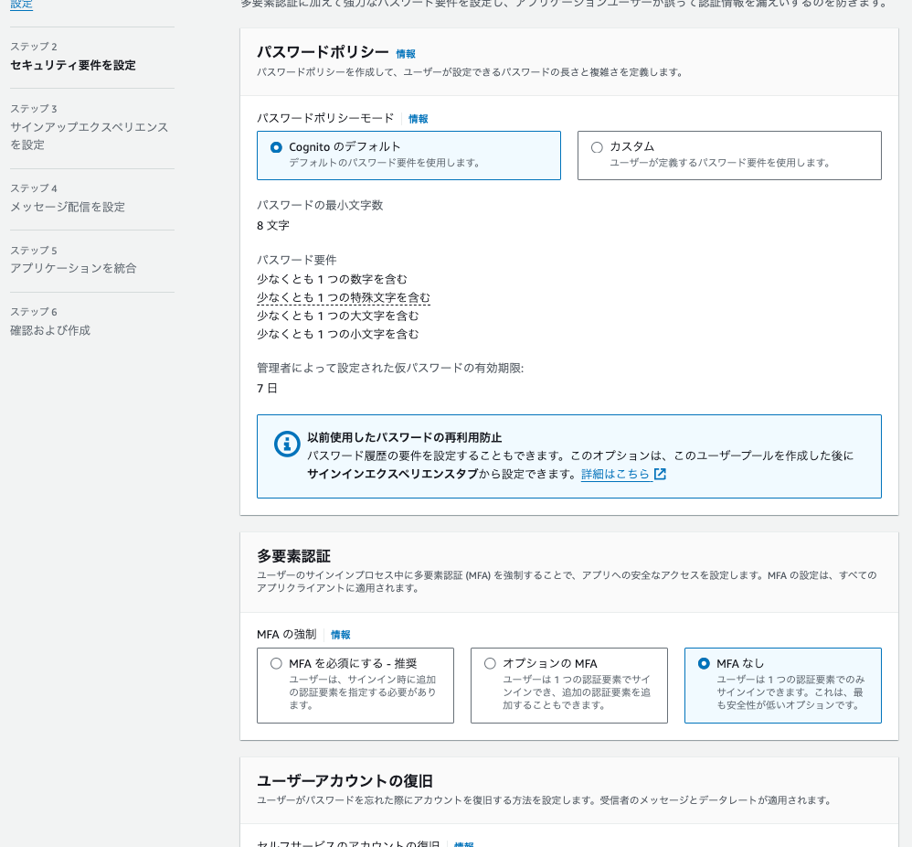

</details>

<details>
<summary> 3. とりあえずエラーが出るのでCognitoの方を設定</summary>

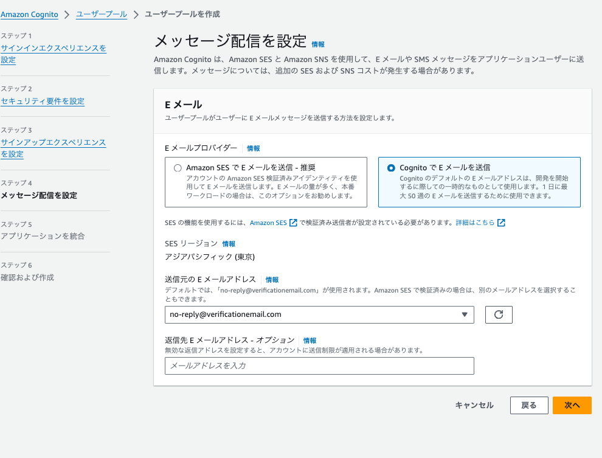

</details>

<details>
<summary> 4. アプリケーションとの統合部分（やること多い）</summary>

- ホストされた認証ページにチュックを入れて、springsecurityのauthorize-urlからアクセスできるCognitoドメインの作成
- 秘密クライエントにチェックを入れて、シークレットの生成
- コールバックURIの登録
- スコープをopenIDで設定（できるだけ少ない情報にしたかった）
- 実際に取れそうなPrincipalは下記の添付

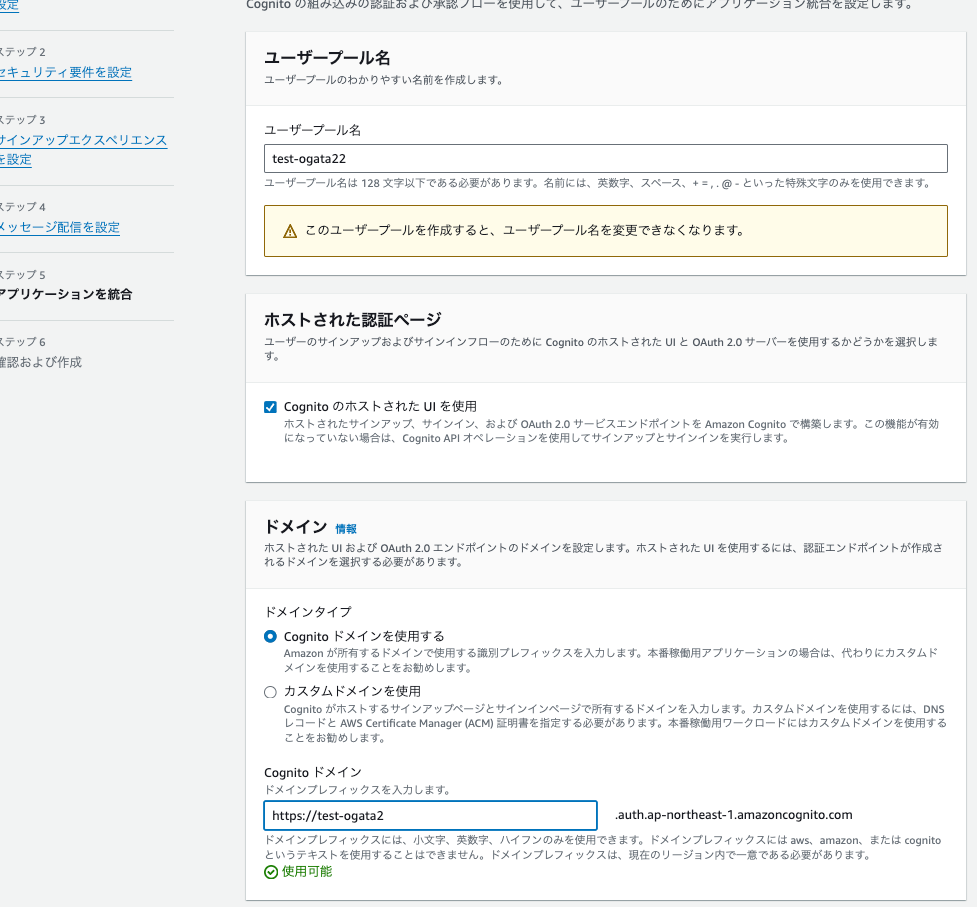
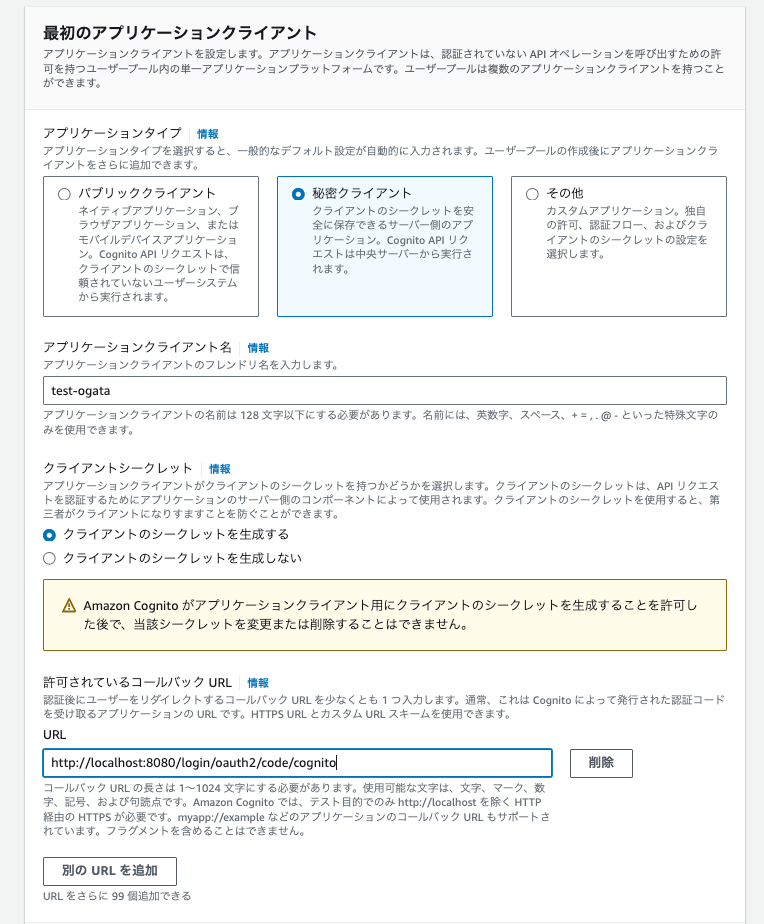
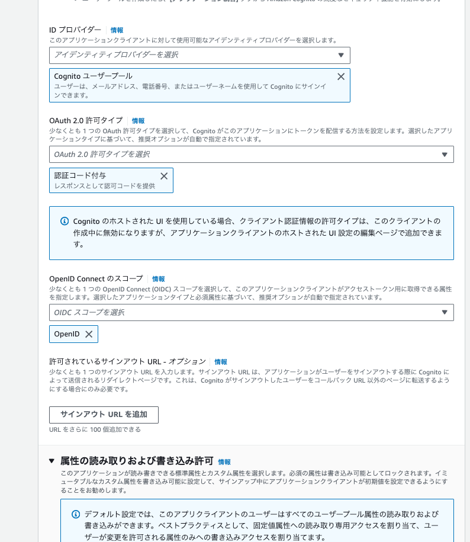
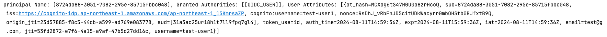

</details>

# 作業手順

<details>
<summary> 1. cloudformation-baseをデプロイ</summary>

- リージョンの設定と、アクセスキーの情報だけ環境変数で必要

```zh
export AWS_DEFAULT_REGION=ap-northeast-1
```

</details>

<details>
<summary> 2. 各種環境変数を設定</summary>

- 実行ターミナルに下記の環境変数を設定

```zh
export AWS_DEFAULT_REGION=hogehoge
export GITHUB_ACCOUNT=hogehoge
export GITHUB_REPOSITORY=hogehoge
export VPC_ID=1で作成したやつ
export SUBNET_ID1=1で作成したやつ
export SUBNET_ID2=1で作成したやつ
export SUBNET_PRIVATE_ID1=1で作成したやつ
export SUBNET_PRIVATE_ID2=1で作成したやつ
export EXISTING_ECS_TASK_ROLE_ARN=hogehoge
export HOSTED_ZONE_ID=hogehoge
export DOMAIN_NAME=hogehoge
export ACM_CERTIFICATE_ARN=hogehoge
export ECR_IMAGE=hogehoge
export ECR_ENDPOINT=hogehoge
export ECR_REPOSITORY_NAME=hogehoge
export ECS_CLUSTER_NAME=hogehoge
export ECS_SERVICE_NAME=hogehoge
export TASK_DEFINITION_FAMILY=hogehoge
export CONTAINER_NAME=hogehoge
```

</details>

<details>
<summary> 3. IAMロールの作成</summary>

- cloudformation-iam-role.ymlをデプロイ

</details>

<details>
<summary> 4. cloudformation-templateをデプロイ</summary>

- cloudformation-templateをデプロイ

</details>

<details>
<summary> 5. cognitoをデプロイ</summary>

- cloudformation-cognito.ymlをデプロイ

</details>


<details>
<summary> 6. new-task-defを更新してPush</summary>

- new-task-defの更新。特に環境変数に気をつけて。AWS上でも必要なシークレットを追加してね。

</details>

# 備考

- 先にACMで証明書発行が必要
- cognitoの認証画面でパスワードをリセットするには「「 E メール確認済み」が「はい」となっており「確認ステータス」が「確認済み」もしくは「未確認」となっているが必須」

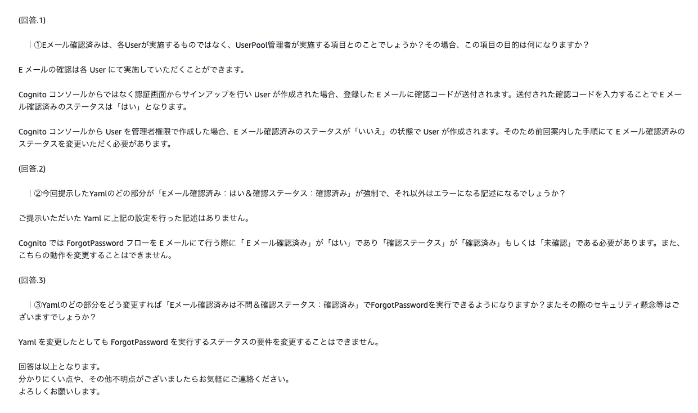
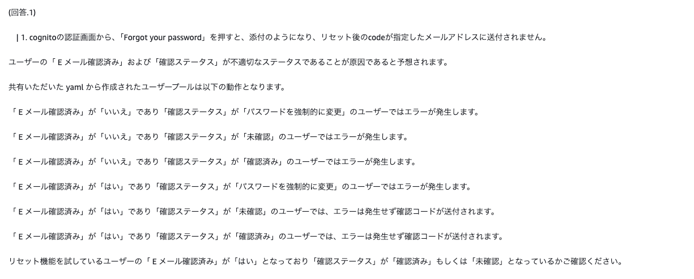
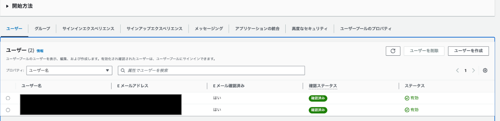

- cognitoで新規User登録した際のresponseに入っているデータ

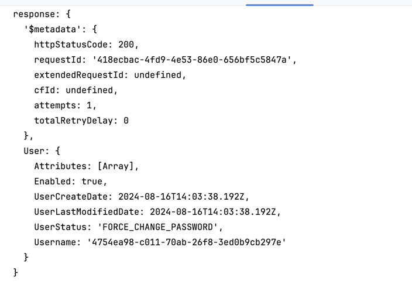

- dockerでdynamodb-localを立ち上げる時になぜか、ボリュームマウントができなかったので、バイマウントで実施。そのためルート直下にdynamodbのメタデータ格納ディレクトリを作成


# 参考

- まず、build.gradleファイルをbuild.gradle.ktsに変更し、Kotlinのプラグインと依存関係を追加します。以下が新しいbuild.gradle.ktsファイルの内容です：
```kotlin
plugins {
    kotlin("jvm") version "1.9.23"
    id("java")
}

repositories {
    mavenCentral()
}

dependencies {
    implementation("org.jetbrains.kotlin:kotlin-stdlib")
    implementation("com.amazonaws:aws-lambda-java-core:1.2.2")
    implementation("com.amazonaws:aws-lambda-java-events:3.11.0")
    testImplementation("junit:junit:4.13.2")
    testImplementation("org.mockito:mockito-core:3.12.4")
}

tasks.withType<org.jetbrains.kotlin.gradle.tasks.KotlinCompile> {
    kotlinOptions {
        jvmTarget = "17"
    }
}

java {
    sourceCompatibility = JavaVersion.VERSION_17
    targetCompatibility = JavaVersion.VERSION_17
} 
```

- 次に、`App.java`ファイルを`App.kt`に変更し、Kotlinで書き直します：
```kotlin
package helloworld

import com.amazonaws.services.lambda.runtime.Context
import com.amazonaws.services.lambda.runtime.RequestHandler
import com.amazonaws.services.lambda.runtime.events.APIGatewayProxyRequestEvent
import com.amazonaws.services.lambda.runtime.events.APIGatewayProxyResponseEvent
import java.io.BufferedReader
import java.io.IOException
import java.io.InputStreamReader
import java.net.URL

class App : RequestHandler<APIGatewayProxyRequestEvent, APIGatewayProxyResponseEvent> {

    override fun handleRequest(input: APIGatewayProxyRequestEvent, context: Context): APIGatewayProxyResponseEvent {
        val headers = mapOf(
            "Content-Type" to "application/json",
            "X-Custom-Header" to "application/json"
        )

        val response = APIGatewayProxyResponseEvent().withHeaders(headers)

        return try {
            val pageContents = getPageContents("https://checkip.amazonaws.com")
            val output = "{ \"message\": \"hello world\", \"location\": \"$pageContents\" }"

            response
                .withStatusCode(200)
                .withBody(output)
        } catch (e: IOException) {
            response
                .withBody("{}")
                .withStatusCode(500)
        }
    }

    @Throws(IOException::class)
    private fun getPageContents(address: String): String {
        val url = URL(address)
        return url.openStream().use { stream ->
            BufferedReader(InputStreamReader(stream)).use { reader ->
                reader.readText()
            }
        }
    }
} 
```

- 最後に、テストファイル`AppTest.java`も`AppTest.kt`に変更し、Kotlinで書き直します：

```kotlin
package helloworld

import com.amazonaws.services.lambda.runtime.Context
import com.amazonaws.services.lambda.runtime.events.APIGatewayProxyRequestEvent
import org.junit.Assert.*
import org.junit.Test
import org.mockito.Mockito.mock

class AppTest {
    @Test
    fun successfulResponse() {
        val app = App()
        val input = APIGatewayProxyRequestEvent()
        val context = mock(Context::class.java)
        val result = app.handleRequest(input, context)
        assertEquals(200, result.statusCode)
        assertEquals("application/json", result.headers["Content-Type"])
        val content = result.body
        assertNotNull(content)
        assertTrue(content.contains("\"message\""))
        assertTrue(content.contains("\"hello world\""))
        assertTrue(content.contains("\"location\""))
    }
}
```

- これらの変更により、@HelloWorldFunctionプロジェクトがKotlinで記述され、実行できるようになります。プロジェクトのディレクトリ構造も以下のように変更する必要があります：
- 1. `src/main/java` を `src/main/kotlin` に変更
- 2. `src/test/java` を `src/test/kotlin` に変更

# java17で動かす

- 1. プロジェクトのルートディレクトリに`.sdkmanrc`ファイルを作成します。
- 2. `.sdkmanrc`ファイルに以下の内容を追加します：

```
java=17.0.7-tem
```

- SDKMANのインストール（入ってない場合）
```zh
curl -s "https://get.sdkman.io" | bash 
```

```zh
source "$HOME/.sdkman/bin/sdkman-init.sh"
```

- SDKMANがインストールされたら、プロジェクトディレクトリで以下のコマンドを実行してJava 17をインストールし、このプロジェクトで使用するように設定できます：

```zh
sdk env install
```

- その後、プロジェクトディレクトリに入るたびに、以下のコマンドを実行してJava 17を使用するように切り替えることができます：

```zh
sdk env
```

# IntelliJでビルドできるように

- モジュールの追加で、Lambda関数になるフォルダをインポートする(build.gradle.ktsが入っているフォルダ)
- SAMがJava17で動作するので、IntelliJの環境もJava１７にする

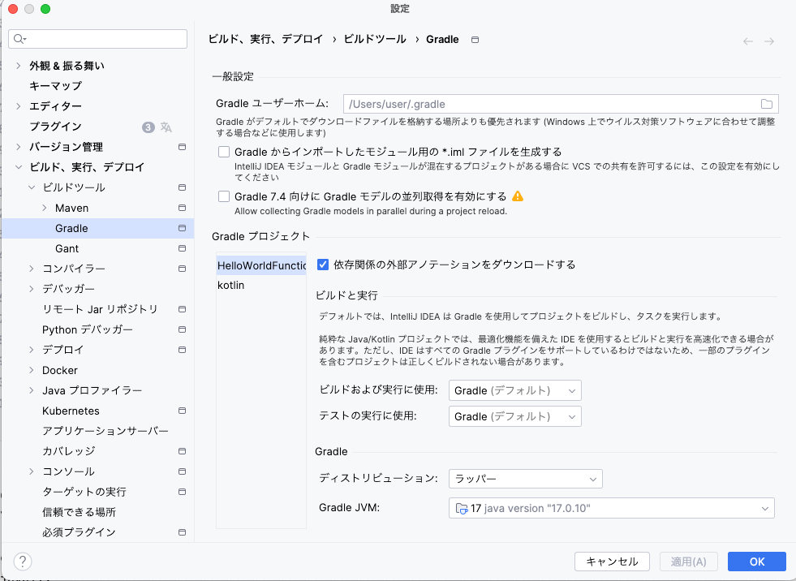
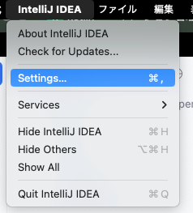


